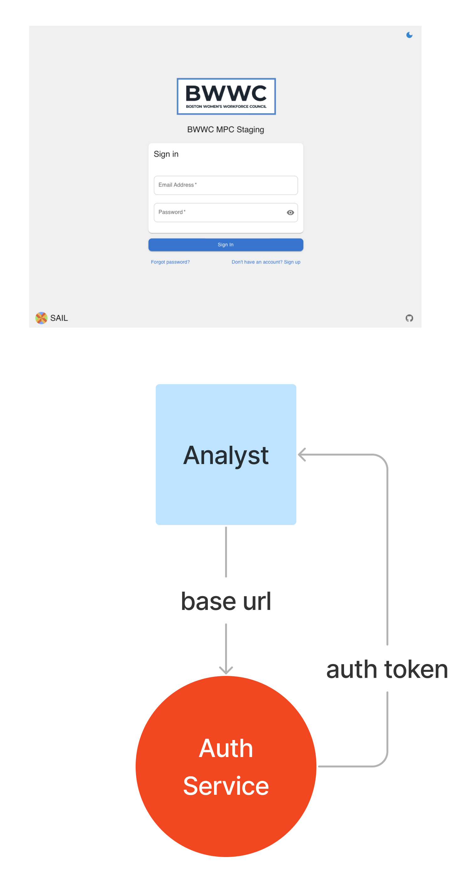
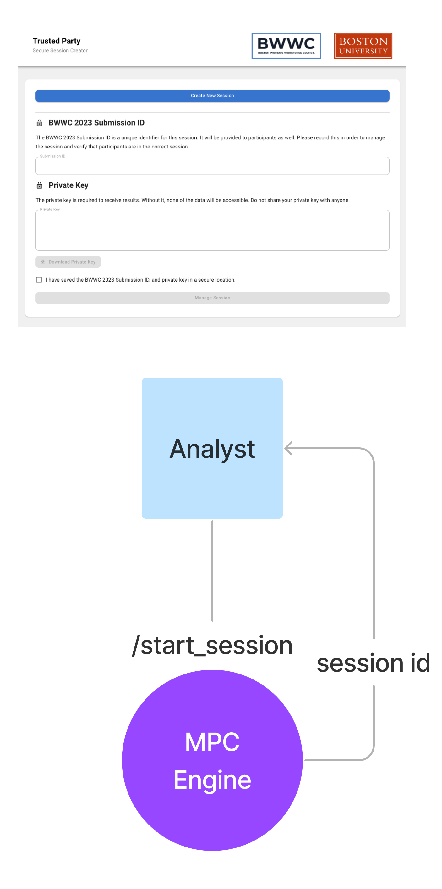
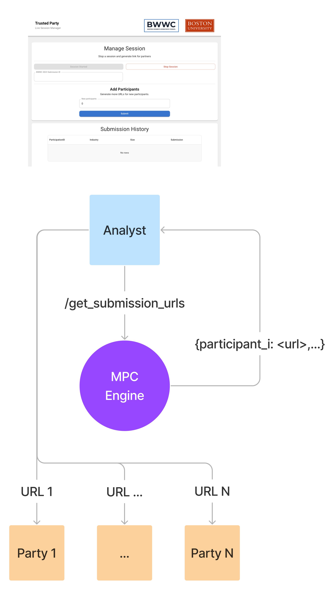
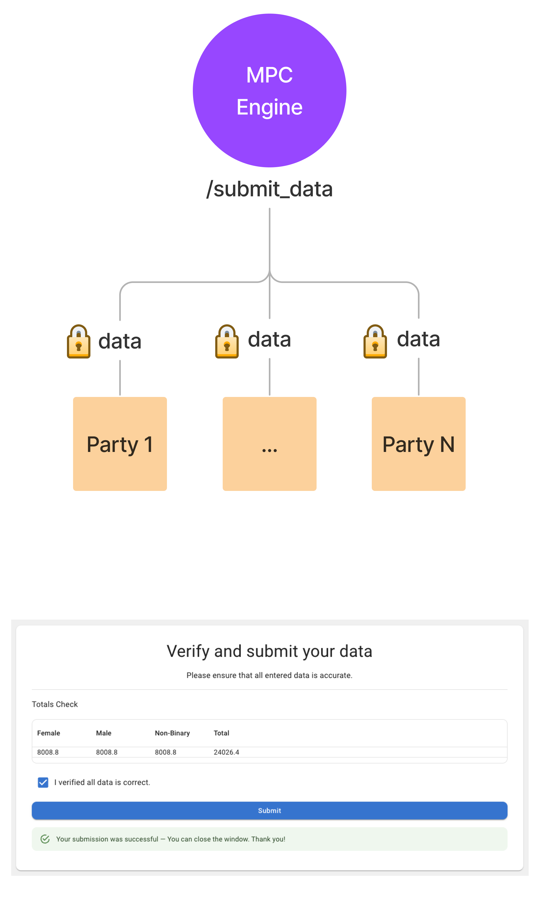
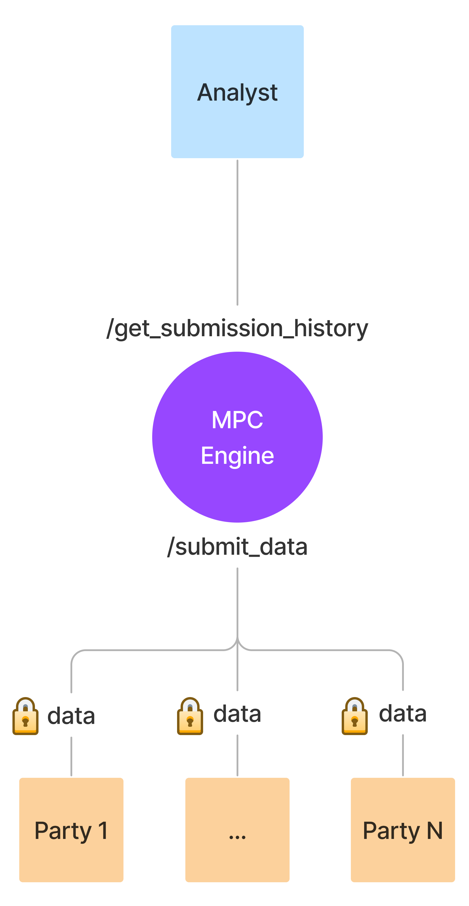
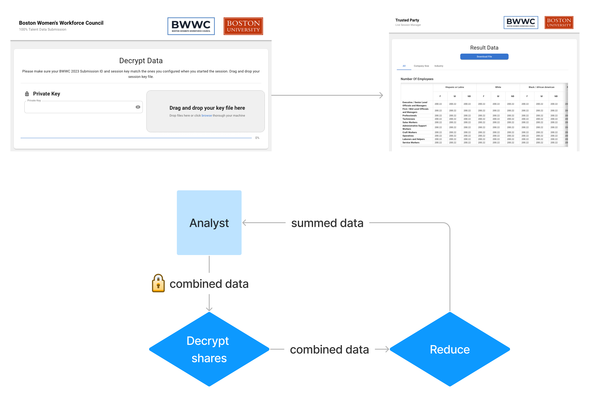

### Boston Women's Workforce Council

This system implements Shamir's secret sharing with asymmetric key cryptography to aggregate and sum tables containing secret values. View this [notebook](https://github.com/ch3njust1n/cryptography/blob/main/Shamirs%20Secret%20Sharing.ipynb#enroll-beta) to learn more about Shamir's Secret Sharing.

### Setup
[Client README](client/README.md)

[Backend README](backend/README.md)

### Workflow

**1. Analyst: Login**

**2. Analyst: Create session**
- Generates a keypair and sends the public key to the server where it can be retrieved by participants submitting data.
- The analyst must download the private key to their local system.

**3. Analyst: Generate submission URLs**

**4. Participant: Get prime and public key**
- Participant submits their table data. The client code then converts each cell into secret shares and encrypts 1 plus the threshold number of shares needed to decrypt. This prevents a malicious server from reconstructing the original tables.

**5. Participant: Submits data**
- Check off the box that all data is correct.
- Click submit.

**6. Analyst: View submission history**
- Client code periodically polls the server from submission history metadata.

**7. Analyst: Stop session**
- When the analyst clicks stop, the backend sets a flag to disable any further submissions.
- The backend then merges all the tables together by adding the shares that are not encrypted with a participants private key.

**8. Analyst: Get submissions**
- After clicking reveal results, the client changes views to the decryption page.
- The analyst opens their private key file to decrypt and then recombine the secret shares to get the actual summed results.
